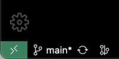

# Dev Container

Developing inside a Container.

## Quick start

1. Install Docker:

    [Install Docker](https://docs.docker.com/get-docker/) on your local environment.
    <br/>

2. Developing inside a Container:

    To get started, read and follow the instructions in [Developing inside a Container](https://code.visualstudio.com/docs/remote/containers). The [.devcontainer](.devcontainer) directory contains pre-configured `devcontainer.json` and `Dockerfile` files, which you can use to set up remote development with a docker container.
    <br/>

3. (optional) Export default Rust toolchain (used by the `rust-analyzer` extension):

    ```sh
    export RUSTUP_TOOLCHAIN=<TOOLCHAIN_TO_INSTALL>
    ```

4. (optional) Define the exported variables in the `.env` file:

    ```sh
    make generate-env-from-env-sample > .devcontainer/.env
    ```

5. Open Folder in Container

    Run the Dev Containers: `Open Folder in Container...` command from the [Command Palette](https://code.visualstudio.com/docs/getstarted/userinterface#_command-palette) or quick actions Status bar item, and select the project folder you would like to set up the container for.

    

6. Run the application:

    Inside the container, run the following command:

    ```sh
    cargo run -- -f resources/assets/rule1.sieve
    ```
